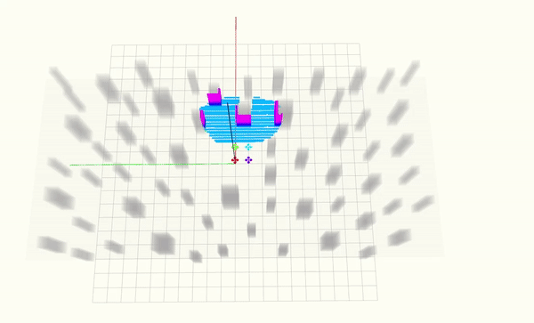

# RACER

**RACER**, a **RA**pid **C**ollaborative **E**xplo**R**ation approach using a
fleet of decentralized UAVs. 

We develop a fully decentralized approach for exploration tasks using a fleet of quadrotors. The proposed system features robustness against unstable communication and a high degree of coordination. The quadrotor team operates with asynchronous and limited communication and does not require any central control. The coverage paths and workload allocations of the team are optimized and balanced in order to fully realize the system's potential. The associated paper has been published in IEEE Transactions on Robotics.


Try [Quick Start](#quick-start) to run a demo in a few minutes!  

<p align="center">
  
  
</p>

__Complete video__: [video](https://www.bilibili.com/video/BV1F14y1g7cG/?spm_id_from=333.337.search-card.all.click).

__Authors__: [Boyu Zhou](http://sysu-star.com) from SYSU, and Hao Xu, [Shaojie Shen](http://uav.ust.hk/group/) from the [HUKST Aerial Robotics Group](http://uav.ust.hk/).

Please cite our paper if you use this project in your research:
- [__RACER: Rapid Collaborative Exploration with a
Decentralized Multi-UAV System__](https://arxiv.org/abs/2209.08533), Boyu Zhou, Hao Xu,  Shaojie Shen, IEEE Transactions on Robotics (**T-RO**) ,

```
@article{zhou2023racer,
  title={Racer: Rapid collaborative exploration with a decentralized multi-uav system},
  author={Zhou, Boyu and Xu, Hao and Shen, Shaojie},
  journal={IEEE Transactions on Robotics},
  year={2023},
  publisher={IEEE}
}
```

Please kindly star :star: this project if it helps you. We take great efforts to develope and maintain it :grin::grin:.

## Table of Contents

- [RACER](#racer)
  - [Table of Contents](#table-of-contents)
  - [Quick Start](#quick-start)
  - [Exploring Different Environments](#exploring-different-environments)
  - [Known issues](#known-issues)
    - [Compilation issue](#compilation-issue)
    - [Unexpected crash](#unexpected-crash)
  - [Acknowledgements](#acknowledgements)

## Quick Start

This project has been tested on Ubuntu 16.04(ROS Kinetic) and 18.04(ROS Melodic). Take Ubuntu 18.04 as an example, run the following commands to install required tools:

```
  sudo apt-get install libarmadillo-dev ros-melodic-nlopt libelf-dev libdw-dev 
```
After that, you need to install __LKH-3__(LKH-3.0.6 version is recommended) with the following commands. Please make sure the executable file `LKH` is correctly placed at `/usr/local/bin`.

```
wget http://akira.ruc.dk/~keld/research/LKH-3/LKH-3.0.6.tgz
tar xvfz LKH-3.0.6.tgz
cd LKH-3.0.6
make
sudo cp LKH /usr/local/bin
```
<!-- To simulate the depth camera, we use a simulator based on CUDA Toolkit. Please install it first following the [instruction of CUDA](https://developer.nvidia.com/zh-cn/cuda-toolkit). 

After successful installation, in the **local_sensing** package in **uav_simulator**, remember to change the 'arch' and 'code' flags in CMakelist.txt according to your graphics card devices. You can check the right code [here](https://github.com/tpruvot/ccminer/wiki/Compatibility). For example:

```
  set(CUDA_NVCC_FLAGS 
    -gencode arch=compute_61,code=sm_61;
  ) 
``` -->

Then simply clone and compile our package (using ssh here):

```
  cd ${YOUR_WORKSPACE_PATH}/src
  git clone https://github.com/SYSU-STAR/RACER.git
  cd ../ 
  catkin_make
```

After compilation you can start a sample swarm exploration demo. Firstly run ```Rviz``` for visualization: 

```
  source devel/setup.bash && roslaunch exploration_manager rviz.launch
```
then run the simulation (run in a new terminals): 
```
  source devel/setup.bash && roslaunch exploration_manager swarm_exploration.launch
```

By default you can see a pillar-like environment. Trigger the quadrotor to start exploration by the ```2D Nav Goal``` tool in ```Rviz```. A sample is shown below, where unexplored structures are shown in grey and explored ones are shown in colorful voxels. The FoV and trajectories of the quadrotor are also displayed.

<!-- You will find a cluttered scene to be explored (20m x 12m x 2m) and the drone . You can trigger the exploration to start by  A sample simulation is shown in the figure. The unknown obstacles are shown in grey, while the frontiers are shown as colorful voxels. The planned and executed trajectories are also displayed. -->

 <p id="demo1" align="center">
  
 </p>


## Exploring Different Environments

The exploration environments in our simulator are represented by [.pcd files](https://pointclouds.org/documentation/tutorials/pcd_file_format.html).
We provide several sample environments, which can be selected in [swarm_exploration.launch](swarm_exploration/exploration_manager/launch/swarm_exploration.launch):

```xml
  <!-- Change office.pcd to specify the exploration environment -->
  <!-- We provide office.pcd, office2.pcd, office3.pcd and pillar.pcd in this repo -->
  <node pkg ="map_generator" name ="map_pub" type ="map_pub" output = "screen" args="$(find map_generator)/resource/pillar.pcd"/>    
```

Other examples can be found in [map_generator/resource](uav_simulator/map_generator/resource). If you want to use your own environments, simply place the .pcd files in [map_generator/resource](uav_simulator/map_generator/resource), and follow the comments above to specify it. You may also need to change the bounding box of explored space in [exploration.launch](swarm_exploration/exploration_manager/launch/single_drone_planner.xml):

```xml
    <arg name="box_min_x" value="-10.0"/>
    <arg name="box_min_y" value="-15.0"/>
    <arg name="box_min_z" value=" 0.0"/>
    <arg name="box_max_x" value="10.0"/>
    <arg name="box_max_y" value="15.0"/>
    <arg name="box_max_z" value=" 2.0"/>
```

To create your own .pcd environments, you can use [this tool](https://github.com/HKUST-Aerial-Robotics/FUEL#creating-a-pcd-environment). 

<!-- ## Creating a _.pcd_ Environment

We provide a simple tool to create .pcd environments.
First, run:

```
  rosrun map_generator click_map
```

Then in ```Rviz```, use the ```2D Nav Goal``` tool (shortcut G) to create your map. Two consecutively clicked points form a wall.
An example is illustrated:-->

<p id="demo5" align="center">

</p>

<!-- After you've finished, run the following node to save the map in another terminal:

```
  rosrun map_generator map_recorder ~/
```

Normally, a file named __tmp.pcd__ will be saved at ```~/```. You may replace ```~/``` with any locations you want.
Lastly, you can use this file for exploration, as mentioned [here](#exploring-different-environments). -->

## Known issues

### Compilation issue

When running this project on Ubuntu 20.04, C++14 is required. Please add the following line in all CMakelists.txt files:

```
set(CMAKE_CXX_STANDARD 14)
```
If you get the following error message,  please try to recompile this project with **catkin_make** .
```
fatal error: plan_env/ChunkStamps.h: No such file or directory
```
### Unexpected crash

If the ```exploration_node``` dies after triggering a 2D Nav Goal, it is possibly caused by the ros-nlopt library. In this case, we recommend to uninstall it and [install nlopt following the official document](https://nlopt.readthedocs.io/en/latest/NLopt_Installation/). Then in the [CMakeLists.txt of bspline_opt package](swarm_exploration/bspline_opt/CMakeLists.txt), change the associated lines to link the nlopt library:

```
find_package(NLopt REQUIRED)
set(NLopt_INCLUDE_DIRS ${NLOPT_INCLUDE_DIR})

...

include_directories( 
    SYSTEM 
    include 
    ${catkin_INCLUDE_DIRS}
    ${Eigen3_INCLUDE_DIRS} 
    ${PCL_INCLUDE_DIRS}
    ${NLOPT_INCLUDE_DIR}
)

...

add_library( bspline_opt 
    src/bspline_optimizer.cpp 
    )
target_link_libraries( bspline_opt
    ${catkin_LIBRARIES} 
    ${NLOPT_LIBRARIES}
    # /usr/local/lib/libnlopt.so
    )  

```

## Acknowledgements
  We use **NLopt** for non-linear optimization and use **LKH** for travelling salesman problem.
